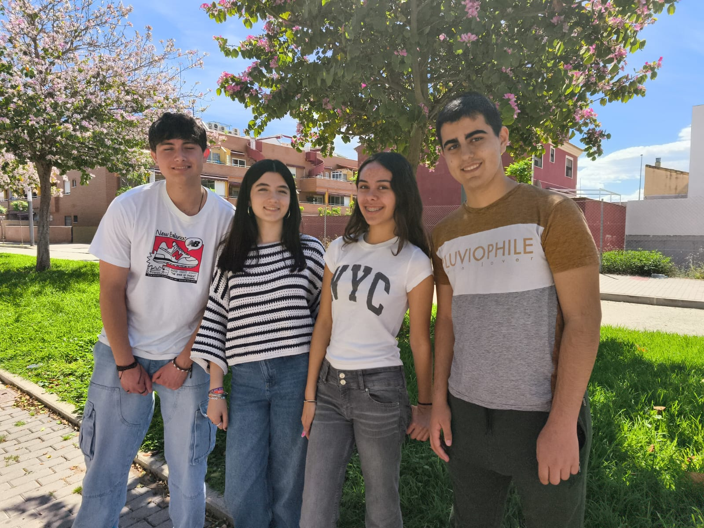
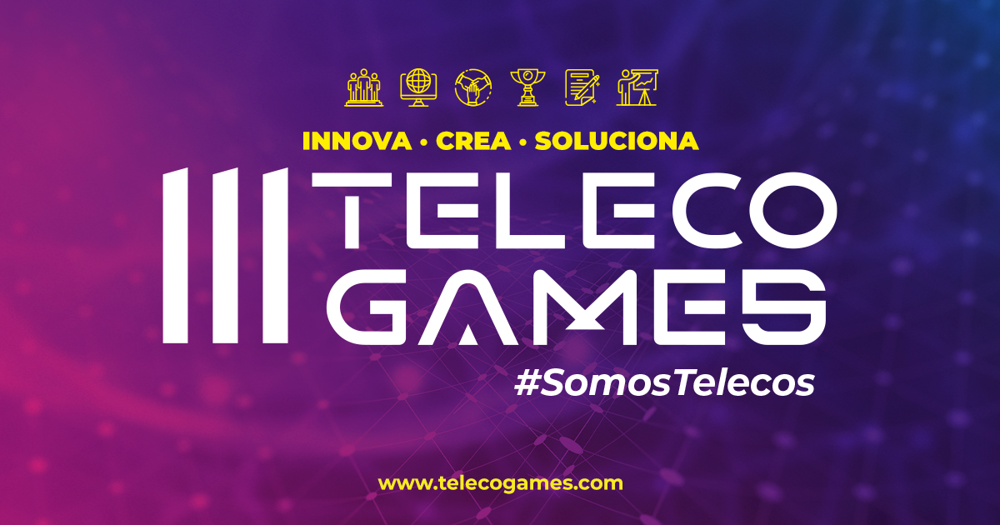

**Proyecto Piscis - Sistema de Acuaponia**

**Introducción**

Hola,

Somos PISCISTELECO y, en este documento, iremos dando un breve resumen de nuestro proyecto. Piscis es un proyecto creado para el concurso de telecomunicaciones TELECO GAMES 2025.
Nuestro objetivo es desarrollar un sistema innovador basado en acuaponia que optimice la producción de alimentos de manera sostenible.

**¿Qué es un sistema de acuaponia?**

Un sistema de acuaponia es una combinación de acuicultura (cría de peces) e hidroponía (cultivo de plantas sin suelo). Este método permite el crecimiento simultáneo de peces y plantas en un entorno controlado, en el que los desechos de los peces proporcionan nutrientes esenciales para las plantas, mientras que estas purifican el agua, creando un ciclo cerrado y eficiente.

**Funcionamiento del sistema**

Nuestro sistema de acuaponia se basa en los siguientes componentes:
1. **Pecera:** Donde los peces crecen y generan residuos ricos en amoníaco.
2. **Plantas:** Convierte el amoníaco en nitratos, una forma de nutriente absorbible por las plantas.
3. **Sistema de cultivo hidropónico:** Donde las plantas absorben los nutrientes y purifican el agua.

**Beneficios del sistema de acuaponia**

- **Sostenibilidad:** Reduce el consumo de agua y elimina la necesidad de fertilizantes químicos.
- **Eficiencia:** Optimiza el uso de recursos, permitiendo una producción más rápida y saludable.
- **Automatización y control inteligente:** Uso de sensores y dispositivos IoT para la monitorización remota y ajuste automático de las condiciones del sistema.
- **Versatilidad:** Puede aplicarse en entornos urbanos, rurales y domésticos, promoviendo la autosuficiencia alimentaria.

**Conclusión**

Piscis es un ecosistema donde peces, plantas y tecnología conviven en armonía.
Hemos demostrado que las telecomunicaciones pueden conectar no solo datos, sino también vida, sostenibilidad y conciencia.
Y lo hacemos en directo, las 24 horas, compartiendo conocimiento con el mundo.

Porque para nosotros, conectar no es solo una cuestión de cables…
 
**Equipo PISCISTELECO**

